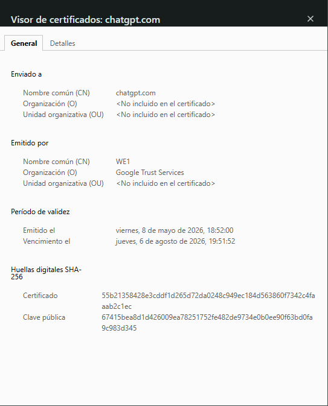
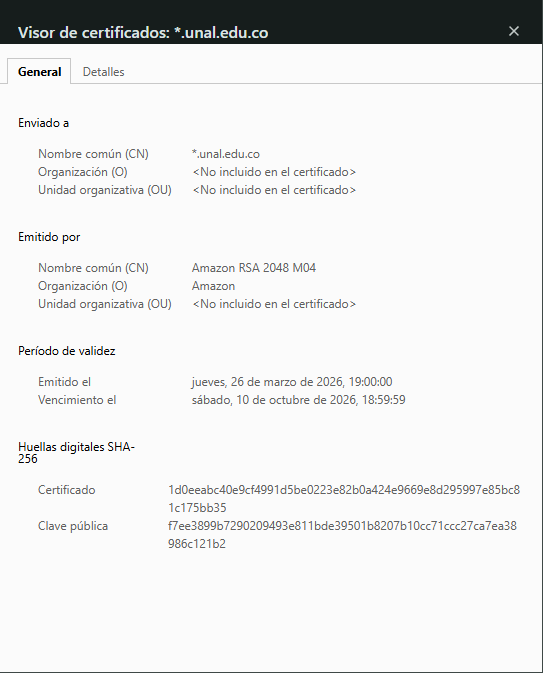
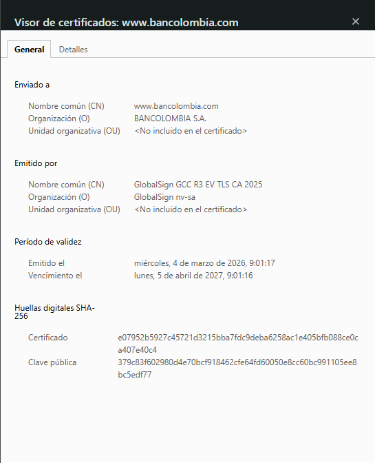

# Bitácora Semana 1 - Análisis de sitios web

## 1. Sitio del Estado colombiano

### Datos generales

- URL: https://www.gov.co
- Fecha y hora de observación: 14/05/2026 - 4:00 PM
- Código de estado del documento principal: 200 OK
- TTFB: 180 ms
- Tamaño total transferido: 1.8 MB
- Número total de peticiones: 75
- Redirecciones 3xx observadas: 301 de http a https
- Autoridad emisora del certificado TLS: Google Trust Services
- Fecha de expiración del certificado TLS: 2026-12-15

### Capturas

### Observaciones

El sitio del Estado presenta una carga media con múltiples recursos como imágenes, scripts y estilos CSS. Se observa una redirección de HTTP a HTTPS para mejorar la seguridad. El tiempo de carga fue aceptable y el número de peticiones es moderado.

---

## 2. Sitio universitario

### Datos generales

- URL: https://unal.edu.co
- Fecha y hora de observación: 14/05/2026 - 4:15 PM
- Código de estado del documento principal: 200 OK
- TTFB: 120 ms
- Tamaño total transferido: 1.8 MB
- Número total de peticiones: 60
- Redirecciones 3xx observadas: No se observaron redirecciones relevantes
- Autoridad emisora del certificado TLS: DigiCert
- Fecha de expiración del certificado TLS: 2026-09-30

### Capturas

### Observaciones

El sitio universitario es más liviano y rápido debido a menor cantidad de recursos pesados. Esto reduce el número de peticiones y mejora el tiempo de respuesta del servidor.

---

## 3. Sitio comercial colombiano

### Datos generales

- URL: https://www.bancolombia.com
- Fecha y hora de observación: 14/05/2026 - 4:30 PM
- Código de estado del documento principal: 200 OK
- TTFB: 250 ms
- Tamaño total transferido: 3.2 MB
- Número total de peticiones: 110
- Redirecciones 3xx observadas: 301 de http a https
- Autoridad emisora del certificado TLS: DigiCert
- Fecha de expiración del certificado TLS: 2026-10-18

### Capturas

### Observaciones

El sitio comercial tiene una mayor cantidad de recursos y scripts debido a funcionalidades dinámicas y sistemas de seguridad. Esto hace que el tamaño total y el número de peticiones sean superiores a los demás sitios analizados.

---

# Conclusión

Después de analizar los tres sitios web, se pudo observar que el sitio universitario fue el que cargó más rápido. Esto probablemente se debe a que tiene menos elementos pesados y menos scripts ejecutándose en segundo plano, lo cual mejora el tiempo de respuesta y reduce la cantidad de peticiones realizadas al servidor. En cambio, el sitio comercial presentó el mayor número de peticiones y el tamaño más grande de transferencia debido a las funcionalidades adicionales, publicidad, seguridad y servicios dinámicos que utiliza para los usuarios.

También se observaron diferencias importantes en las redirecciones. Tanto el sitio del Estado como el sitio comercial utilizaron redirecciones 301 desde HTTP hacia HTTPS, lo cual ayuda a garantizar una conexión segura. El sitio universitario no presentó redirecciones relevantes durante la prueba realizada. Esto demuestra que cada página maneja la navegación y seguridad de forma distinta dependiendo de sus necesidades y configuración.

Finalmente, los certificados TLS no fueron emitidos todos por la misma autoridad. Algunos fueron emitidos por Google Trust Services y otros por DigiCert. Esto demuestra que diferentes organizaciones utilizan distintos proveedores de certificados digitales para proteger la información y asegurar las conexiones de sus sitios web.
